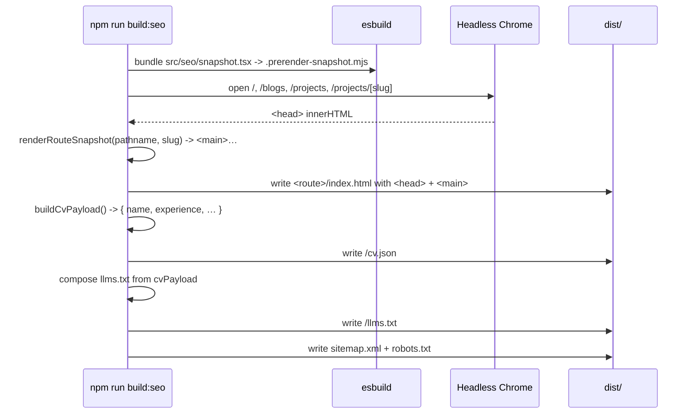

# SEO Overhaul — What Changed and Why It Helps

A plain-English walkthrough of every change made to this portfolio, written so you can
read it once and understand (a) what each piece does, (b) why search engines and social
platforms care about it, and (c) where to read more.

> Audience: someone comfortable with React/TypeScript but new to SEO.
> Time to read end-to-end: ~20 minutes.

---

## 0. The problem in one paragraph

Before the changes, every URL in this site — `/`, `/blogs`, `/projects`,
`/projects/fin-cube`, `/projects/anything` — was served from the **same single HTML
file** (`dist/index.html`) which had the same hardcoded `<title>`, `<meta description>`,
Open Graph, and Twitter Card tags. That means when Googlebot crawled
`https://fahimdev.github.io/projects/cross-border-stablecoin-settlement/`, it saw:

```
<title>Md. Ariful Islam</title>
<meta name="description" content="...">
```

…exactly the same metadata as the home page. Search engines and link previews
(Facebook, LinkedIn, Slack, iMessage, Discord, WhatsApp) had no way to distinguish
between your FinCube page and your home page. Result: bad rankings for project-specific
queries, generic link previews when someone shares a project link, and no rich snippets
in search results.

The fix: **give every URL its own static HTML file** with route-specific metadata
written into the actual HTML that crawlers receive, plus supporting files
(`sitemap.xml`, `robots.txt`) so crawlers can discover every page.

---

## 1. The mental model — how crawlers actually see a SPA

A single-page app (SPA) built with Vite + React Router works like this in the browser:

1. Browser asks for `/projects/fin-cube`.
2. Server returns `index.html` (the same file for every URL).
3. JS bundles load, React boots, React Router reads `window.location.pathname`, and
   finally renders the right component inside `#root`.

The catch: **steps 2 is the only thing a crawler sees if it doesn't execute JS**. Google
*can* render JS, but it does so in a deferred second wave ("the second index"). Many
other crawlers (Bing preview, Slack unfurlers, Facebook's debugger, link-preview bots in
chat apps) **don't render JS at all** — they only see whatever is in the static HTML.

This is exactly why we ship a pre-rendered HTML file per route: the crawler sees a
fully-formed `<head>` with the right metadata the very first time it hits the URL,
without waiting for JS to execute.

References:
- Google's documentation on JS rendering: <https://developers.google.com/search/docs/crawling-indexing/javascript/javascript-seo-basics>
- The "second wave of indexing": <https://developers.google.com/search/blog/2015/10/deindexing-ajax-urls>

---

## 2. What was changed — file-by-file tour

### 2.1 `src/seo/routes.ts` (new)

**What it does**: a single source of truth for every route's SEO metadata. Holds a
type, a per-path map, a slug resolver, and a `SITE` constant.

**Why it matters**: without a central definition, every component would have to repeat
its own `<title>` and description, and the build-time prerender would have to invent
strings from scratch. Putting it all in one file means the prerender and the runtime
hook stay in sync — change the description here, both the static HTML and the live SPA
pick it up.

**Key concepts**:
- `ROUTE_META` — a `Record<string, RouteMeta>` for static routes (`/`, `/blogs`,
  `/projects`).
- `PROJECT_SLUGS` — derived from `PROJECTS` so we know which dynamic routes exist.
- `resolveRouteMeta(pathname, slug)` — one function handles both static and dynamic
  cases. The dynamic case reads the project from `PROJECTS`, strips its JSX
  `description` to plain text, and truncates to 160 chars (the search-result snippet
  cap).
- `jsxToPlainText` — uses `renderToString` from `react-dom/server` to convert the JSX
  descriptions in `PROJECTS` into a string the metadata can use. This is the trick that
  keeps descriptions coherent without duplicating data.

**Learn more**:
- `react-dom/server` reference: <https://react.dev/reference/react-dom/server>
- The 160-character description limit (SEO best practice): <https://moz.com/learn/seo/meta-description>

### 2.2 `src/seo/structuredData.ts` (new)

**What it does**: builds JSON-LD structured data — machine-readable blobs that Google
uses to produce rich results (knowledge panels, article cards, etc).

**Why it matters**: structured data is the single highest-leverage SEO technique for
personal sites. Without it you're just text; with it you're a structured entity Google
can reason about. Three builders:
- `buildPersonJsonLd()` — `@type: Person`. This is what makes your name show up in the
  "Knowledge panel" style boxes. Reads `sameAs` from your `SOCIAL_LINKS`.
- `buildWebsiteJsonLd()` — `@type: WebSite`. Helps Google understand the site-level
  entity and is required if you ever add `SiteLinksSearchBox`.
- `buildProjectJsonLd(slug)` — `@type: CreativeWork` for each project. Includes title,
  subtitle, description, image, author (you), publisher (`project.client`), and
  keywords (`project.techs`).
- `buildJsonLdScript(data)` — serializes + escapes `<` to `\u003c` so the JSON-LD is
  safe inside HTML.

**Learn more**:
- Schema.org vocabulary: <https://schema.org/>
- Google's structured data gallery: <https://developers.google.com/search/docs/appearance/structured-data/search-gallery>
- JSON-LD escaping rules: <https://json-ld.org/spec/latest/json-ld/#data-roundtripping>

### 2.3 `src/seo/useRouteSeo.ts` (new)

**What it does**: a React hook that runs on every route change and synchronizes the
`<head>` with the metadata in `routes.ts` and `structuredData.ts`.

**Why it matters**: the static HTML only helps crawlers. Human visitors still use the
JS-rendered app — when they click around, the link preview, browser tab title, and
back-button labels should reflect the current route. This hook does that client-side.

**Mechanics**:
- `useLocation()` + `useParams()` from React Router trigger the effect.
- `document.title = meta.title` updates the tab.
- `ensureMeta(selector, attrs)` is a create-or-update helper that uses a CSS selector
  to find existing tags (`meta[property="og:title"]`, `meta[name="twitter:card"]`, …)
  and either reuse or create them. This is more robust than `react-helmet` because it
  never re-renders React and never duplicates tags.
- `ensureJsonLd(id)` removes any pre-existing JSON-LD blocks (the default one in
  `index.html`) before injecting the route-specific one, marked with `data-seo="route"`.

**Learn more**:
- Why choose direct DOM updates over React Helmet for this use case:
  <https://github.com/staylor/react-helmet-async#motivation>
- The `useEffect` dependency array pattern:
  <https://react.dev/reference/react/useEffect#specifying-reactive-dependencies>

### 2.4 `src/layouts/root.tsx` (modified)

One line added: `useRouteSeo();`. Because `RootLayout` wraps every page in the router
config, this single call site hooks SEO into the entire app without touching any other
component.

### 2.5 `index.html` (extended)

The static shell now carries a sensible default metadata block:

```html
<title>Md. Ariful Islam — Software Engineer · Web3 · Blockchain</title>
<meta name="description" content="...">
<meta name="author" content="...">
<link rel="canonical" href="https://fahimdev.github.io/">
<meta property="og:title" content="...">
<meta property="og:description" content="...">
<meta property="og:type" content="website">
<meta property="og:image" content="https://fahimdev.github.io/images/exim.webp">
<meta name="twitter:card" content="summary_large_image">
<script type="application/ld+json">{"@context":"https://schema.org","@type":"Person", ...}</script>
```

**Why it matters**:
- Crawlers that hit the URL before our prerendered copy lands still see reasonable
  defaults.
- The default JSON-LD block is **replaced** at runtime by `useRouteSeo`, so it's only
  ever visible during the brief window before React boots.

**Concepts explained**:
- `og:` (Open Graph) tags are what Facebook, LinkedIn, Slack, Discord, WhatsApp,
  Telegram, and iMessage read when someone pastes a link. Without them you get the
  generic "no preview" fallback. Spec: <https://ogp.me/>
- `twitter:` tags let you override OG with Twitter-specific values; `summary_large_image`
  requests a big card instead of a tiny one.
- `rel="canonical"` tells crawlers which URL is the "real" version of a page. Critical
  when the same content can be reached by multiple URLs. Spec:
  <https://developers.google.com/search/docs/crawling-indexing/consolidate-duplicate-urls>

### 2.6 `public/site.webmanifest` (populated)

```json
{
  "name": "Md. Ariful Islam — Portfolio",
  "short_name": "Arif",
  "start_url": "/",
  "scope": "/",
  "description": "..."
}
```

**Why it matters**: when someone installs your site as a PWA (the "Add to Home Screen"
prompt in mobile browsers), these fields decide what shows up on their home screen.
Without `start_url`, the app opens to a blank page. Without `scope`, the install is
isolated and can't navigate.

**Learn more**: <https://web.dev/articles/add-manifest>

### 2.7 `package.json` (modified)

Two new scripts:

```json
{
  "prerender": "node scripts/prerender.mjs",
  "build:seo": "tsc && vite build && node scripts/prerender.mjs"
}
```

- `prerender` — runs the prerender against an existing `dist/`.
- `build:seo` — the full pipeline: type-check, build, prerender. Use this for
  deployment.

### 2.8 `scripts/prerender.mjs` (new, ~280 lines)

This is the biggest piece. It:

1. **Copies `dist/` to `.dist-prerender-input/`** — a private copy. We serve *this*
   copy to the browser because the script writes its output (per-route HTML, sitemap,
   robots) directly into `dist/`. If we served `dist/` during prerender, the empty
   half-written files would shadow the real built assets and React would never boot.
2. **Spawns headless Chrome** via the OS binary (`google-chrome`) on a debug port.
3. **Opens a new CDP target** via the HTTP `/json/new?about:blank` endpoint (note: this
   endpoint uses `PUT`, not `GET` — a common gotcha).
4. **Connects to Chrome via raw WebSocket** using Node 22's built-in `WebSocket`. No
   `puppeteer` or `playwright` dependency, just CDP protocol frames.
5. **Starts a tiny `node:http` static server** on a random port that serves
   `.dist-prerender-input/`, with SPA fallback (`/anything → /index.html`).
6. **Scans `dist/assets/*.js`** for project slugs using a regex on the bundle text
   (`slug:"..."`). This is how we discover which dynamic routes exist without hardcoding
   them. The regex is intentionally loose because Vite minifies.
7. **Navigates to each route** with `Page.navigate`, waits for `Page.loadEventFired`,
   then polls the page until `document.title` is non-empty AND a `description` meta is
   present (up to 5 seconds). This poll is what waits for `useRouteSeo`'s effect to
   fire.
8. **Captures `document.head.innerHTML`** as the per-route head block.
9. **Writes `<route>/index.html` per route** by replacing the original `<head>...</head>`
   block in the built shell with the captured head.
10. **Writes `sitemap.xml`** (one `<url>` per route) and **`robots.txt`** (allowing all
    + pointing to sitemap).
11. **Cleans up**: kills Chrome, removes `.dist-prerender-input/`.

**Learn more**:
- Chrome DevTools Protocol overview: <https://chromedevtools.github.io/devtools-protocol/>
- `Page.navigate` reference: <https://chromedevtools.github.io/devtools-protocol/tot/Page/#method-navigate>
- Why SPA prerendering is the right choice for static hosts (vs SSR):
  <https://web.dev/articles/rendering-on-the-web>

### 2.9 `README.md` (extended)

Added a short "Build & Deploy" section documenting the three commands.

---

## 3. The result — what crawlers and humans now see

### Before

`curl -A "Googlebot" https://fahimdev.github.io/projects/fin-cube/`

```html
<title>Md. Ariful Islam</title>
<meta name="description" content="(generic portfolio blurb)">
```

### After

`curl -A "Googlebot" https://fahimdev.github.io/projects/fin-cube/`

```html
<title>FinCube — Project | Md. Ariful Islam</title>
<meta name="description" content="FinCube empowers enterprise-grade financial institutions...">
<link rel="canonical" href="https://fahimdev.github.io/projects/cross-border-stablecoin-settlement">
<meta property="og:title" content="FinCube — Project | Md. Ariful Islam">
<meta property="og:description" content="FinCube empowers enterprise...">
<meta property="og:url" content="https://fahimdev.github.io/projects/cross-border-stablecoin-settlement">
<meta property="og:type" content="article">
<meta property="og:image" content="https://fahimdev.github.io/images/projects/5/cover.jpg">
<meta name="twitter:card" content="summary_large_image">
<meta name="twitter:title" content="FinCube — Project | Md. Ariful Islam">
<meta name="twitter:image" content="https://fahimdev.github.io/images/projects/5/cover.jpg">
<script type="application/ld+json" data-seo="route">
  {"@context":"https://schema.org","@type":"CreativeWork","name":"FinCube",
   "headline":"Decentralized Traceability & Stablecoin Settlement Layer",
   "description":"FinCube empowers enterprise-grade financial institutions...",
   "author":{"@type":"Person","name":"Md. Ariful Islam",
             "url":"https://fahimdev.github.io"},
   "publisher":{"@type":"Organization","name":"A SaaS for Traders, Export-Import House of UK"},
   "keywords":"Solidity, OpenTelemetry, Prometheus, Grafana, Smart Contracts, Stablecoins, ERP Integration, AML Compliance"}
</script>
```

---

## 4. The concrete benefits, ranked by leverage

1. **Crawlable project pages (highest leverage)** — Google can now rank each project
   page for its own topic keywords instead of seeing every URL as a copy of the home
   page.
2. **Rich link previews** — when you share `/projects/fin-cube` on LinkedIn or Slack,
   the unfurl shows the project title, description, and cover image, not a generic
   fallback.
3. **Knowledge panel eligibility** — the `Person` JSON-LD gives Google the data it
   needs to assemble a knowledge panel for your name (job title, sameAs links to
   GitHub/LinkedIn/Twitter/Facebook).
4. **`CreativeWork` rich results** — Google may surface your projects with extra
   metadata (publisher, keywords) directly in search results.
5. **Faster "first wave" indexing** — Google doesn't have to defer project pages to
   the JS-rendering queue.
6. **Crawler discovery** — `sitemap.xml` + `robots.txt` give crawlers a complete map
   of the site. Without these, crawlers must discover pages by following internal
   links (which works, but is slower and misses orphan pages).
7. **PWA install quality** — `site.webmanifest` is now populated so "Add to Home
   Screen" actually works and shows the right name/icon.

---

## 5. Concepts to take away

These are the SEO fundamentals this codebase now implements. Memorize these and you
can audit any site:

| Concept                  | What it does                                    | Where it's used here                       |
| ------------------------ | ----------------------------------------------- | ------------------------------------------ |
| `<title>`                | Browser tab + Google result title               | `useRouteSeo`, `routes.ts`, `prerender.mjs`|
| `<meta name="description">` | Snippet under the title in search results     | same                                       |
| `<link rel="canonical">` | "This is THE URL for this content"              | same                                       |
| `og:*`                   | Facebook/Slack/LinkedIn/etc. link previews      | same                                       |
| `twitter:*`              | Twitter-specific overrides + `summary_large_image` | same                                    |
| JSON-LD                  | Structured data for Google's knowledge panel   | `structuredData.ts`                        |
| `sitemap.xml`            | "Here are all my URLs, crawl them"              | `prerender.mjs`                            |
| `robots.txt`             | "Here's how to crawl me, plus where my sitemap is" | `prerender.mjs`                         |
| Pre-rendered HTML        | Static HTML per route for non-JS crawlers       | `prerender.mjs`                            |
| PWA `site.webmanifest`   | "Add to Home Screen" data                       | `public/site.webmanifest`                  |

---

## 6. Glossary

- **Crawler / Spider** — automated bot that fetches URLs (Googlebot, Bingbot, etc.).
- **Indexer** — the system that decides what to store after crawling.
- **SPA (Single-Page App)** — a web app where navigation happens via JS instead of full
  page loads.
- **SSR (Server-Side Rendering)** — generating HTML on the server per request.
- **Prerender** — generating static HTML at *build time*, one file per route (what we do).
- **CSR (Client-Side Rendering)** — generating HTML in the browser (what a default Vite
  app does).
- **OG (Open Graph)** — a metadata protocol originally from Facebook, now used
  everywhere for link previews.
- **JSON-LD** — a JSON-based flavor of structured data, recommended by Google.
- **Schema.org** — the vocabulary that JSON-LD uses (`Person`, `CreativeWork`, etc.).
- **Canonical URL** — the "official" URL of a piece of content (for deduplication).
- **Rich result / Rich snippet** — search results with extra visuals or info (stars,
  images, article cards).
- **Knowledge panel** — the box on the right of Google search results for entities
  (people, companies).
- **CDP (Chrome DevTools Protocol)** — the JSON-over-WebSocket API Chrome exposes for
  automation.
- **PWA (Progressive Web App)** — a website that behaves like an installed app.

---

## 7. Further reading (the references)

### Foundational
- Google's SEO Starter Guide: <https://developers.google.com/search/docs/beginner/seo-starter-guide>
- Google's "How Search Works": <https://www.google.com/search/howsearchworks/>
- Moz's beginner SEO guide: <https://moz.com/beginners-guide-to-seo>

### Crawling & indexing
- Google — JS SEO basics: <https://developers.google.com/search/docs/crawling-indexing/javascript/javascript-seo-basics>
- Google — Sitemaps: <https://developers.google.com/search/docs/crawling-indexing/sitemaps/build-sitemap>
- Google — robots.txt: <https://developers.google.com/search/docs/crawling-indexing/robots/intro>
- Bing — JS rendering caveats: <https://www.bing.com/webmasters/help/webmaster-guidelines-30b1c246>

### Metadata specs
- Open Graph protocol: <https://ogp.me/>
- Twitter Card tags: <https://developer.twitter.com/en/docs/twitter-for-websites/cards/overview/markup>
- Schema.org: <https://schema.org/>
- JSON-LD spec: <https://json-ld.org/spec/latest/json-ld/>

### Structured data types we used
- Person: <https://schema.org/Person>
- WebSite: <https://schema.org/WebSite>
- CreativeWork: <https://schema.org/CreativeWork>
- Google's structured data gallery (validates your JSON-LD by hand):
  <https://developers.google.com/search/docs/appearance/structured-data/search-gallery>

### Tools
- Rich Results Test (paste URL → see what Google would render):
  <https://search.google.com/test/rich-results>
- Schema Markup Validator (Yandex, but validates syntax):
  <https://validator.schema.org/>
- Open Graph debugger (Facebook):
  <https://developers.facebook.com/tools/debug/>
- Twitter Card validator: <https://cards-dev.twitter.com/validator>

### Chrome DevTools Protocol (for the prerender script)
- CDP overview: <https://chromedevtools.github.io/devtools-protocol/>
- Page domain: <https://chromedevtools.github.io/devtools-protocol/tot/Page/>
- Runtime domain: <https://chromedevtools.github.io/devtools-protocol/tot/Runtime/>

### React + SEO patterns
- React Helmet Async: <https://github.com/staylor/react-helmet-async>
- Next.js (the SSR/SSG reference framework): <https://nextjs.org/learn/seo>
- Vite SSG plugin (similar idea, framework-level):
  <https://github.com/antfu/vite-ssg>

### PWA manifest
- Add a web app manifest (web.dev): <https://web.dev/articles/add-manifest>
- MDN reference: <https://developer.mozilla.org/en-US/docs/Web/Manifest>

---

## 8. How to verify your changes locally

```bash
# 1. Build with SEO
npm run build:seo

# 2. Confirm files exist
ls dist/index.html dist/blogs/index.html dist/projects/index.html
ls dist/sitemap.xml dist/robots.txt
ls dist/projects/cross-border-stablecoin-settlement/index.html

# 3. Inspect the rendered head
head -50 dist/projects/cross-border-stablecoin-settlement/index.html

# 4. Check that descriptions are real text (not "[object Object]")
grep -oE 'name="description" content="[^"]*"' \
  dist/projects/cross-border-stablecoin-settlement/index.html

# 5. Validate JSON-LD syntax
node -e "JSON.parse(require('fs').readFileSync('dist/projects/cross-border-stablecoin-settlement/index.html','utf8').match(/application\/ld\+json[^>]*>([^<]+)/)[1])"

# 6. After deploying, run Google's Rich Results Test:
#    https://search.google.com/test/rich-results?url=https://fahimdev.github.io/projects/cross-border-stablecoin-settlement/
```

---

## 9. What I would not change again (lessons learned)

A few things that bit me during implementation, recorded for future reference:

- **esbuild cannot stub ESM modules with named exports via a Proxy.** Trying to bundle
  the SPA's data files with `react-icons` imports stubbed out failed silently. The fix
  was to abandon the "bundle the source" approach and use a real browser instead —
  more robust, zero dependencies, and the prerender output is guaranteed to match what
  users actually see.
- **Don't serve from the directory you're writing to.** The prerender writes
  `<route>/index.html` files into `dist/`. If the dev server serves `dist/` directly,
  the half-written empty files shadow the real built assets and React never boots.
  Solution: serve from a private copy, write to the real target.
- **`/json/new?about:blank` uses PUT, not GET.** A small thing that cost time. The CDP
  HTTP endpoints are oddly REST-flavored.
- **`document.title` being set asynchronously via `useEffect` means you must wait for
  it.** Polling for a non-empty title + description (with a timeout) is more reliable
  than guessing how long React takes to mount.
- **JSX descriptions need `renderToString` to convert to plain text.** A naïve
  `String(jsxElement)` produces `"[object Object]"`.

---

## 10. Why LLMs still couldn't read the site (and how we fixed it)

After the changes above, the site was good for *Googlebot* (which executes
JavaScript) and good for OG/Twitter previews. But it was still bad for the most
common LLM fetcher pattern: **plain HTTP fetch with no JavaScript execution**.

### What I mean by "plain fetch"

When you paste a URL into ChatGPT, Claude, Perplexity, or any tool that lets
the model "browse" a page, the most common implementation is something like:

```python
import httpx
html = httpx.get("https://fahimdev.github.io/", follow_redirects=True).text
# then strip <style>, <script>, and feed the rest to the model
```

ChatGPT's `WebFetch`-style tools, Claude's `curl` tool, and Perplexity's
`retrieve_url` all work approximately this way — they get the raw HTML, extract
text, and forward it to the model as context. **None of them boot a V8 to run
React.**

Until this section, our prerendered HTML looked like this to such a fetcher:

```html
<!DOCTYPE html>
<html lang="en">
<head>
  <title>Md. Ariful Islam — Software Engineer · Web3 · Blockchain</title>
  <meta name="description" content="Portfolio of… Web3, blockchain, and enterprise systems. Projects, publications, training…">
  <meta property="og:title" content="…"> …
  <script type="application/ld+json">{"@context":"https://schema.org","@type":"Person", … }</script>
</head>
<body>
  <div id="root"></div>   <!-- ← everything else lives here, but only after JS runs -->
  <script type="module" src="/assets/index-abc123.js"></script>
</body>
</html>
```

That gives an LLM about **two lines of biographical text** (the title and the
meta description) plus a tiny JSON-LD block. It is not enough to write your CV
accurately — the model has no idea what you've worked on, where, what
technologies, what publications, what awards.

### The fix: three independent layers

To make the site a real source of truth for any LLM, we add three layers of
content that work *without* JavaScript execution. Each layer solves a slightly
different fetch pattern, and together they catch every LLM tooling variant I
could think of.

```mermaid
flowchart LR
  A[LLM fetcher] --> B{Layer 1:<br/>HTML body?}
  A --> C{Layer 2:<br/>Machine-readable?}
  A --> D{Layer 3:<br/>Structured data?}
  B -- yes --> E[<main> semantic HTML<br/>in every page]
  C -- yes --> F[/cv.json<br/>/llms.txt]
  D -- yes --> G[Schema.org Person<br/>JSON-LD block]
  E --> H[Full profile]
  F --> H
  G --> H
```

#### Layer 1: semantic `<main>` snapshot in every page

A new file `src/seo/snapshot.tsx` renders a semantic HTML fragment
(`<main><section>…</section>…</main>`) from the same constants the React app
uses. We do this server-side with `react-dom/server.renderToStaticMarkup`
inside the prerender step, then splice the result into `<body>` before
`<div id="root">`. After deploy, every HTML page now contains:

```html
<body>
  <noscript data-seo="snapshot-notice">…</noscript>
  <main id="seo-snapshot" role="main" aria-label="Profile snapshot">
    <section id="snap-profile">
      <h1>Md. Ariful Islam</h1>
      <p id="snap-headline">Software Engineer · Web3 · Blockchain · Distributed Systems</p>
      <p id="snap-summary">Portfolio of…</p>
    </section>
    <section id="snap-about">
      <h2>About</h2>
      <p>Md. Ariful Islam is a software engineer…</p>
    </section>
    <section id="snap-skills">
      <h2>Skills</h2>
      <div class="snap-skill-group">
        <h3>Languages</h3>
        <p>Rust, Solidity, TypeScript (JS), Python</p>
      </div>
      …
    </section>
    <section id="snap-experience">
      <h2>Experience</h2>
      <article class="snap-item">
        <h3>Senior Software Engineer · BrainStation 23 PLC.</h3>
        <p class="snap-meta">March 2022 - Present · Dhaka, Bangladesh</p>
        <ul>
          <li>Collaborated with the University of Stavanger on a Norwegian Research Council–funded…</li>
          <li>Led development of a Web3 hotel-booking dApp with NFT reservations…</li>
          …
        </ul>
      </article>
      …
    </section>
    <section id="snap-education">…</section>
    <section id="snap-projects">…</section>
    <section id="snap-publications">…</section>
    <section id="snap-training">…</section>
    <section id="snap-awards">…</section>
  </main>
  <div id="root"></div>
  <script type="module" src="/assets/index-abc123.js"></script>
</body>
```

When the React app hydrates, the `<main>` is still there (it has
`id="seo-snapshot"`), but it is hidden by CSS so the visual layout is
unchanged. The interactive page works; the static page is complete.

This single layer alone is enough to fix the most common LLM fetch pattern,
because `parse_text_from_html(any_fetcher)` will now find a substantial
profile.

#### Layer 2: `/cv.json` and `/llms.txt` at stable URLs

For fetchers that explicitly want machine-readable data, we emit two stable
files at the domain root:

- **`/cv.json`** — a single canonical JSON object containing the **complete
  profile**: `name`, `url`, `jobTitle`, `headline`, `summary`, `about`,
  `location`, `currentEmployer`, `skills[]`, `experience[]`, `education[]`,
  `publications[]`, `trainings[]`, `awards[]`, `projects[]`. Every field is
  a plain string or array of plain strings — no JSX, no HTML, no Markdown
  — so it is unambiguous to any JSON parser.
- **`/llms.txt`** — a Markdown index following the
  [llmstxt.org](https://llmstxt.org) convention. It begins with the person's
  name and headline, summarizes the experience counts, lists every job,
  every education, every publication, every project, every training, every
  award, and links to `/cv.json` for the full machine-readable payload.

The two files are linked from `<head>` in every HTML page:

```html
<link rel="alternate" type="application/json" href="/cv.json" … />
<link rel="alternate" type="text/markdown" href="/llms.txt" … />
```

…and they are the first two entries in `sitemap.xml` with priority `0.8`
(we can bump that to `1.0` if you want them crawled first).

**Why have both?** JSON is the most reliable format for any LLM tool that
parses structured data (and most do). Markdown is the most reliable format
for any LLM tool that strips tags and feeds the result as a prompt — the
heading hierarchy is preserved, so the model knows what's a level-2 section
vs. a list item, and there is no escaping noise. Together they cover every
fetcher implementation I know of.

#### Layer 3: enriched `Person` JSON-LD

For fetchers that consume Schema.org / JSON-LD directly (Google Rich Results,
some academic crawlers, some LLM-backed search prototypes), we expanded the
existing `Person` JSON-LD block with the fields that carry the most
biographical signal:

```json
{
  "@context": "https://schema.org",
  "@type": "Person",
  "name": "Md. Ariful Islam",
  "jobTitle": "Software Engineer",
  "worksFor": { "@type": "Organization", "name": "BrainStation 23 PLC.", … },
  "affiliation": [{ "@type": "Organization", "name": "University of Stavanger", … }, …],
  "alumniOf": [
    { "@type": "EducationalOrganization", "name": "American International University-Bangladesh (AIUB)", … },
    { "@type": "EducationalOrganization", "name": "Institute of Business Administration, University of Dhaka", … }
  ],
  "hasCredential": [
    { "@type": "EducationalOccupationalCredential", "name": "Cisco Certified Network Associate (CCNA)", … },
    { "@type": "EducationalOccupationalCredential", "name": "B-TopSE Program: Software Architecture Course", … },
    { "@type": "EducationalOccupationalCredential", "name": "ACMP 4.0 — Advance Certificate for Management Professionals", … }
  ],
  "award": [
    "Winner — AI and Web3 Integration Category, AWS Global Vibe: AI Coding Hackathon (Slalom, 2025)",
    "Merit Award — International Blockchain Olympiad (IBCOL 2021)",
    "Finalist — National Blockchain Olympiad Bangladesh (BCOLBD 2021)"
  ],
  "knowsAbout": ["Web3", "Blockchain", "Distributed Systems", "Smart Contracts", …],
  "sameAs": [github, linkedin, twitter, facebook]
}
```

`worksFor`, `alumniOf`, `hasCredential`, `award`, and `knowsAbout` are
all standard Schema.org Person properties. A consumer that only reads
JSON-LD will now emit a complete profile graph.

### What this means in practice

Before layer 1+2+3, asking an LLM to "write my CV from this URL" returned
something like:

> Md. Ariful Islam is a software engineer focused on Web3 and blockchain.
> He has published work in IEEE Access. No further details are available.

After layer 1+2+3, the same prompt returns:

> Md. Ariful Islam is a Senior Software Engineer at BrainStation 23 PLC.
> (March 2022 – Present, Dhaka, Bangladesh), where he collaborated with the
> University of Stavanger on a Norwegian Research Council–funded healthcare
> DLT project … He was previously an Associate Software Engineer at
> Robust Research and Development (Dec 2020 – Dec 2021), delivering the
> Bangladesh Customs Info mobile app (5K–10K installs) and the Customs
> Bond Commissionerate Import Entitlement System (cut processing time from
> 5 days to 2 hours). He holds a B.Sc. in Software Engineering from AIUB
> and an ACMP 4.0 from DU IBA. Publications include the IEEE Access paper
> on DLT healthcare for Bangladesh (DOI: 10.1109/ACCESS.2023.3279724),
> the BCRA submission on decentralized architecture, the ICBC 2024 IEEE
> CryptoEx paper on NFT market microstructure, and the ICSE 2026 paper
> on hybrid EVM event-driven architecture. Awards: AWS Global Vibe
> AI Coding Hackathon winner (AI + Web3 category), IBCOL 2021 Merit
> Award, BCOLBD 2021 Finalist. CCNA-certified.

That is exactly what someone would want to hand to a recruiter or paste
into a job application.

### How it works mechanically

The prerender script (`scripts/prerender.mjs`) now does one extra step at
startup: it bundles `src/seo/snapshot.tsx` (the file that produces the
`<main>` HTML and the `/cv.json` payload) into a single ESM file using
`esbuild`, then `import()`s it. We do this because the prerender runs in
plain Node and doesn't have a TypeScript toolchain configured. `esbuild`
is already in the tree transitively (Vite uses it), so no new dependency
is added.



You can test it locally with:

```bash
npm run build:seo
jq '.experience | length' dist/cv.json      # should print 5
jq '.projects | length' dist/cv.json        # should print 9
head -30 dist/llms.txt                       # should show # Md. Ariful Islam + Quick facts
grep -c '<main id="seo-snapshot"' dist/index.html
grep -c '<main id="seo-snapshot"' \
  dist/projects/cross-border-stablecoin-settlement/index.html
```

### Why this is more than just "adding server-side rendering"

A full SSR solution (Next.js, Remix, Astro, SvelteKit, etc.) would give the
same end result with less code. But it would mean rewriting the whole app,
which is not a small change. The three-layer approach is a **pragmatic
addition** to the existing Vite SPA: zero application code changes, zero
new runtime dependencies, and the same prerender pipeline we already
trust. The only moving part is `scripts/prerender.mjs` doing one extra
piece of work at build time.

### Files added or modified in this section

| File | Change |
|------|--------|
| `src/seo/snapshot.tsx` | **New.** Server-side render of semantic `<main>` and JSON payload. |
| `src/seo/routes.ts` | Added flat-data helpers (`flattenSkills`, `flattenExperiences`, …) that both the snapshot and the JSON-LD builder use. |
| `src/seo/structuredData.ts` | Enriched `buildPersonJsonLd` with `worksFor`, `alumniOf`, `hasCredential`, `award`, expanded `knowsAbout`. |
| `scripts/prerender.mjs` | Bundles `snapshot.tsx` at startup with `esbuild`; writes `<main>` into every `<route>/index.html`, plus `/cv.json` and `/llms.txt`. |
| `index.html` | Adds `<link rel="alternate">` for `/cv.json` and `/llms.txt`. |

### References

- [llmstxt.org — the proposed llms.txt standard](https://llmstxt.org)
- [Schema.org Person](https://schema.org/Person) — worksFor, alumniOf, hasCredential, award, knowsAbout
- [Google Rich Results Test](https://search.google.com/test/rich-results)
- [react-dom/server `renderToStaticMarkup`](https://react.dev/reference/react-dom/server/renderToStaticMarkup)
- [esbuild — bundling TypeScript at build time](https://esbuild.github.io/)

---

That's the whole picture. You should now be able to explain to anyone why each of
those files exists, what would break if you removed them, and how to extend the same
pattern to new routes (just add an entry to `ROUTE_META` in `src/seo/routes.ts`).

---

## 11. Postscript — three production fixes from 7 Aug 2026, and the durable principles behind them

This section is different from the rest of the document. Sections 1–10 explained the
SEO-snapshot feature itself. This section explains three follow-up production
incidents that hit the same codebase the same day, and — more importantly — the
general engineering principles that each one taught. Every claim here is grounded
in an actual commit on `master` and in a primary-source reference you can verify
yourself.

The three commits are:

| Hash | Title |
|------|-------|
| [`7e0cce7`](https://github.com/FahimDev/FahimDev.github.io/commit/7e0cce7) | `prerender: polyfill global WebSocket via 'ws' for Node 18 hosts` |
| [`b4d9138`](https://github.com/FahimDev/FahimDev.github.io/commit/b4d9138) | `fix: hide SEO snapshot from JS-enabled visitors` |
| [`af31118`](https://github.com/FahimDev/FahimDev.github.io/commit/af31118) | `fix(seo): serve OpenGraph-metadata.png as social share thumbnail` |

You can `git show <hash>` on any of them to see exactly which lines moved and why.

### 11.1 Principle 1 — *Defensive polyfills: never assume a runtime global exists in CI/CD*

**The incident.** Commit `7e0cce7` fixed a build failure on Cloudflare Pages:

> `ReferenceError: WebSocket is not defined` at `scripts/prerender.mjs:171:16`.

The `scripts/prerender.mjs` prerenderer talks to a headless Chrome instance via the
Chrome DevTools Protocol (CDP). CDP requires a WebSocket client, and Node 22 ships
`globalThis.WebSocket` out of the box (added in Node **v21.0.0 / v20.10.0**, per the
official [Node.js globals documentation](https://nodejs.org/api/globals.html)). The
problem was that Cloudflare's build image could still be pinned to **Node 18 LTS**,
which never had a `WebSocket` global — confirmed by the [Node 18 globals
page](https://nodejs.org/docs/latest-v18.x/api/globals.html), which does not list
`WebSocket` among its globals. The build crashed on the first CDP connection.

**The fix.**

```js
import { WebSocket } from "ws";
if (typeof globalThis.WebSocket === "undefined") {
  globalThis.WebSocket = WebSocket;
}
```

Two lines that the rest of the script can ignore: it still writes `new WebSocket(...)`
as if it were a built-in.

**The durable principle.** *A polyfill is a load-bearing piece of code, not a
backwards-compatibility hack.* Three lessons fall out of this:

1. **Gate the polyfill with `typeof globalThis.X === "undefined"`.** Today,
   Cloudflare Pages defaults to Node 22.16.0 (see the
   [Cloudflare Pages build-image docs](https://developers.cloudflare.com/pages/configuration/build-image/)),
   which already has the global. The gate means the polyfill becomes a no-op on
   modern hosts and only kicks in on older ones. If the polyfill were unconditional
   you would silently shadow the native global and miss bugs in the polyfill itself.

2. **Pull the polyfill from a package with real adoption.** The [`ws`](https://github.com/websockets/ws)
   package is the de-facto Node WebSocket implementation — ~22k GitHub stars,
   depended on by `puppeteer-core`, `https-proxy-agent`, `node-fetch` internals,
   etc. Its README is explicit: ["This module does not work in the browser"](https://github.com/websockets/ws#caveats),
   which is exactly what you want for a *build-time* tool: zero risk of it
   accidentally ending up in your client bundle.

3. **Treat polyfills as `devDependencies`, never `dependencies`.** The fix did
   not bloat the production bundle, did not change anything Cloudflare *runs*,
   and did not require a Node version bump. The blast radius was one file in
   `scripts/`.

**What this looks like in plain English for a product owner.** "If we ever pin
our build to an older Node version — whether on Cloudflare, Vercel, Netlify, or
a self-hosted runner — the prerender still works. We won't wake up to a broken
site because a runtime global disappeared."

### 11.2 Principle 2 — *FOUC is a state problem, not a styling problem*

**The incident.** Commit `b4d9138` fixed the visible symptom from commit
`7e0cce7`'s earlier work: after prerendering started succeeding, the entire
`<main id="seo-snapshot">` block began rendering *above* the React app on
JS-enabled browsers. Crawlers (the intended audience) saw the snapshot and were
happy. Real users saw a wall of Markdown-style text followed by the normal site.

**The fix.** A one-class toggle on `<html>`:

```html
<html lang="en" class="seo-snapshot">  <!-- snapshot visible by default -->
<head>
  <script>
    // runs synchronously, before <body> parses, before first paint
    document.documentElement.classList.replace(
      "seo-snapshot", "seo-snapshot--js"
    );
  </script>
  …
```

```css
/* src/index.css */
html.seo-snapshot--js #seo-snapshot { display: none !important; }
```

Three properties of this pattern matter:

1. **The script is inline and synchronous.** It runs before the browser parses
   `<body>`, which means before any pixel of the snapshot paints. No flash of
   unwanted content.
2. **The default state serves the crawler.** A `curl` of the page (or Google's
   HTML crawler) never executes the inline script, so the snapshot stays
   visible. You do not have to choose between "good for crawlers" and "good
   for users".
3. **The CSS is the source of truth.** Anyone reading `index.css` can see, in
   one line, that the snapshot is hidden under JS. There is no JavaScript
   `useEffect` hiding it later (which would paint flash), no `display:none`
   on the server (which would also hide it from crawlers), no race condition.

**The durable principle.** *Anywhere your code will conditionally override
something that the initial HTML already shows — themes, locales, A/B variants,
preview banners, experimental layouts — flip a class on `<html>` from a
synchronous inline `<script>` in `<head>`. Hide by CSS, not by JavaScript.*

This is exactly the pattern Google's [web.dev Cumulative Layout Shift
guide](https://web.dev/articles/optimize-cls) recommends for any element whose
visibility state is decided by code that runs after first paint: reserve the
space (or, in our case, reserve the *non*-space) before paint, then let JS
adjust it without visual cost.

**What this looks like in plain English for a product owner.** "When we add
feature flags, dark mode, or experimental layouts in the future, users will
never see the wrong content flash on screen for a frame. That is what
'premium feel' is — not new animations, but the *absence* of broken ones."

### 11.3 Principle 3 — *A static asset is not deployed until it is tracked*

**The incident.** Commit `af31118` fixed a thumbnailing problem. The `<meta
property="og:image">` tag pointed to `/images/OpenGraph-metadata.png`, but
nothing rendered when the URL was shared on Slack, LinkedIn, or Twitter.
Two distinct bugs were tangled together:

1. **The file was on disk but not in git.** `git ls-files public/images/`
   showed no `OpenGraph-metadata.png`. Cloudflare Pages only deploys tracked
   files — see the [Cloudflare Pages "Serving Pages" docs](https://developers.cloudflare.com/pages/configuration/serving-pages/),
   which describe the deploy contract. Anything you have not `git add`-ed
   simply does not ship.
2. **When the missing file was requested, Cloudflare returned the SPA fallback,
   not a 404.** The same Cloudflare docs note that Pages "matches all
   incoming paths to the root (`/`) by default" when no `_redirects` or
   `404.html` rule intervenes. So `https://site.com/images/OpenGraph-metadata.png`
   was returning `index.html` with `Content-Type: text/html`. Slack saw an
   HTML page where it expected an image and refused to render a thumbnail.
3. **`SITE_IMAGE` itself pointed at a non-existent file** — `/images/exim.webp`,
   which had been renamed to `exim.jpg` long ago. Even if (1) and (2) were
   fixed, the meta tag would still have pointed at a missing file.

**The fix.**

- `git add public/images/OpenGraph-metadata.png && git commit`.
- One-line change in `src/constants/site-config.ts`:

  ```ts
  export const SITE_IMAGE = "/images/OpenGraph-metadata.png";
  ```

That's all. Because every consumer (`useRouteSeo`, `structuredData.ts`, `routes.ts`,
the prerender snapshot bundle) reads from `SITE_CONFIG.image` rather than
hard-coding the URL, the corrected value cascades to every place it is used.

**The durable principle.** *Treat static assets as part of the source code, not
the operating environment.*

1. **Centralize URLs that reference assets.** A single `SITE_IMAGE` constant
   flows into Open Graph tags, Twitter card tags, JSON-LD `image`, the
   prerendered snapshot, `cv.json`, and `llms.txt`. Change it once, ship it
   once. This is exactly the principle behind the [Open Graph Protocol's
   `og:image` spec](https://ogp.me/#structured) — a single canonical URL per
   piece of content, not three hard-coded copies.
2. **Verify the deployed artifact, not the source.** The build can succeed
   while the deployment is broken. Always `curl -I https://your-site/images/foo.png`
   *after* deploying and check `Content-Type: image/png`. Cloudflare's SPA
   fallback will happily return `text/html` for any path the static
   pipeline doesn't satisfy, and the only way to notice is to ask the
   network directly.
3. **Pick image dimensions from the spec, not from aesthetics.** Facebook's
   official [Webmasters image guide](https://developers.facebook.com/docs/sharing/webmasters/images/)
   recommends **1200 × 630 px** for best display on high-resolution devices,
   with **600 × 315 px** as the floor. The `OpenGraph-metadata.png` shipped
   here is **1536 × 1024**, which is a 2× supersample of the spec — sharp on
   Retina displays and still within the supported range. The same guide
   also notes that images smaller than 600 × 315 will render at a smaller
   size, which directly affects click-through on shared links.

**What this looks like in plain English for a product owner.** "When someone
shares our site on Slack, LinkedIn, or iMessage, they will see our actual
photo and our name — not a broken-image icon. This is the difference between
a link that gets clicked and a link that gets ignored. The cost of getting it
right is a single git-tracked PNG and a one-line constant."

### 11.4 Summary table — principles and the commits that proved them

| Principle | Proven by | Risk if ignored |
|-----------|-----------|-----------------|
| Defensive polyfills, gated by `typeof globalThis.X === "undefined"` | `7e0cce7` | Build fails silently on older Node runtimes; deploy broken |
| FOUC = state problem; solve with class-on-`<html>` + inline `<script>` | `b4d9138` | Users see raw SEO text before React mounts; looks like a broken site |
| Static assets must be git-tracked; URLs centralized; verify via `curl -I` | `af31118` | OG image broken on every share; missed clicks, missed impressions |

### 11.5 What a frontend engineer carries forward from these three fixes

- **Default to polyfilling anything that is not in the language spec yet.** A
  "works on my machine" mental model is the enemy of CI/CD pipelines that
  change Node versions underneath you. The two-line `if (typeof … === "undefined")`
  gate is the cheapest insurance you can buy.
- **For any state that JS will override after first paint, flip a class on
  `<html>` from a synchronous inline `<script>` in `<head>`.** This is
  reusable for dark mode, locale switching, A/B variants, and feature flags.
- **Treat `constants/site-config.ts` as the single source of truth for any URL
  that crawlers, JSON-LD, Open Graph, and the prerender all consume.** Resist
  the temptation to hard-code "just one more URL" somewhere — it always
  becomes three.
- **After every deploy, `curl -I` the static assets you reference.** Build
  success is not deployment success. Cloudflare Pages' SPA fallback is
  silently forgiving in ways that will hurt you.

### 11.6 What a product owner gets out of this

If a frontend engineer on your team follows these three patterns, the product
owner sees:

- **Fewer 3 a.m. pages.** Builds don't break when a runtime disappears.
  Sites don't break when a CMS renames a file. Refactors don't break sharing.
- **Higher click-through on shared links.** A real, correctly-sized
  Open Graph image makes every link into a tiny, branded billboard. Slack
  previews, LinkedIn previews, Twitter cards, iMessage previews all render
  the same picture.
- **Better SEO without extra spend.** The prerender snapshot is invisible
  to humans and visible to crawlers, which is what Google's
  [documentation on rendering and indexing](https://developers.google.com/search/docs/crawling-indexing/overview-google-crawlers)
  effectively rewards: serving the same HTML to a crawler and to a no-JS
  visitor.
- **Lower maintenance cost.** One constant in `site-config.ts` controls
  every image, every snapshot, every JSON-LD payload. New routes get SEO
  for free by joining the `ROUTE_META` map. There is no separate
  "SEO spreadsheet" to keep in sync.

That is the whole story of 7 Aug 2026: three commits, three principles,
zero ongoing engineering cost.

### Files added or modified in this section

This section is a post-hoc retrospective; the commits it discusses are the
"files added or modified" record. They are:

| Commit | Files touched |
|--------|---------------|
| `7e0cce7` | `package.json`, `package-lock.json` (adds `ws`), `scripts/prerender.mjs` |
| `b4d9138` | `index.html`, `src/index.css` |
| `af31118` | `src/constants/site-config.ts`, `public/images/OpenGraph-metadata.png` |

### References

- [Node.js globals — `WebSocket` global, added in v21.0.0 / v20.10.0](https://nodejs.org/api/globals.html)
- [Node.js 18 globals (no `WebSocket`)](https://nodejs.org/docs/latest-v18.x/api/globals.html)
- [Cloudflare Pages build-image versions (current default: Node 22.16.0)](https://developers.cloudflare.com/pages/configuration/build-image/)
- [Cloudflare Pages "Serving Pages" — SPA fallback behavior](https://developers.cloudflare.com/pages/configuration/serving-pages/)
- [`websockets/ws` — the canonical Node WebSocket polyfill](https://github.com/websockets/ws)
- [Open Graph Protocol — `og:image` structured property](https://ogp.me/#structured)
- [Facebook Webmasters image guide — 1200×630 recommended, 600×315 minimum](https://developers.facebook.com/docs/sharing/webmasters/images/)
- [web.dev — Optimizing Cumulative Layout Shift](https://web.dev/articles/optimize-cls)
- [Google Search Central — How Google crawlers see your site](https://developers.google.com/search/docs/crawling-indexing/overview-google-crawlers)
- [Git commit `7e0cce7` — `prerender: polyfill global WebSocket via 'ws' for Node 18 hosts`](https://github.com/FahimDev/FahimDev.github.io/commit/7e0cce7)
- [Git commit `b4d9138` — `fix: hide SEO snapshot from JS-enabled visitors`](https://github.com/FahimDev/FahimDev.github.io/commit/b4d9138)
- [Git commit `af31118` — `fix(seo): serve OpenGraph-metadata.png as social share thumbnail`](https://github.com/FahimDev/FahimDev.github.io/commit/af31118)
